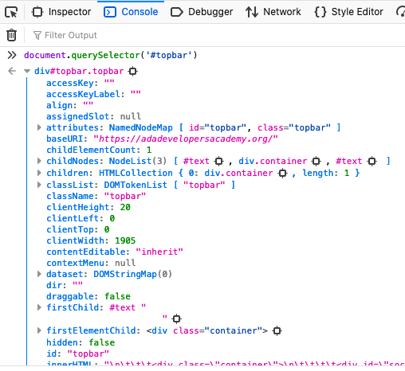

# Closures Continued

<iframe src="https://adaacademy.hosted.panopto.com/Panopto/Pages/Embed.aspx?pid=027b61ba-8415-48d7-b0fe-ac89014231f4&autoplay=false&offerviewer=true&showtitle=true&showbrand=false&start=0&interactivity=all" height="405" width="720" style="border: 1px solid #464646;" allowfullscreen allow="autoplay"></iframe>

## Learning Goals

By the end of this lesson we will be able to...

- Explain the concept of a closure
- Identify a closure in existing code
- Describe how a closure is useful with browser-based code

## Introduction

Often when building a single page application, you will need to have many UI elements that each do something similar. An example of this is a list of contacts, where clicking on the name of a contact pops up a modal showing details.

A simpler example is a set of buttons which can each change the color of a box on the screen, [as in this codesandbox](https://codesandbox.io/s/kind-ritchie-6z3dz). Don't worry too much about the code itself yet, just the functionality of the buttons.

<iframe src="https://codesandbox.io/embed/kind-ritchie-6z3dz?fontsize=14&hidenavigation=1&theme=dark"
     style="width:100%; height:600px; border:0; border-radius: 4px; overflow:hidden;"
     title="kind-ritchie-6z3dz"
     allow="accelerometer; ambient-light-sensor; camera; encrypted-media; geolocation; gyroscope; hid; microphone; midi; payment; usb; vr; xr-spatial-tracking"
     sandbox="allow-forms allow-modals allow-popups allow-presentation allow-same-origin allow-scripts"
   ></iframe>

Because the UI elements have such similar behavior, we want to use the same function to handle each one. However, that function needs to know a little bit of extra information about which element it's attached to. This is where closures come in.

**A closure is a way to attach some extra information to a function.**

Doing event handling in the browser is something new and we will handle it a bit differently in React.  However these are common use-cases where people take advantage of closures when interacting with the DOM.

## A bit on JS "vanilla" in the Browser

You may hear the term "vanilla" in regards to JavaScript.  This just means using regular JavaScript without a framework.  A lot of developers these days only use frameworks because they make interacting with web pages much easier.  That said, it can be quite useful to know a few things about "vanilla" JavaScript and how it interacts with the browser.

### Window & Document

In the browser JavaScript has access to two objects `window` and `document`.  The `window` object represents the open browser window and `document` represents the HTML document or DOM (document is actually an attribute of `window`).  

Open up Firefox Developer tools and go to the console.  Then type `document` and hit enter, what do you get?

You get an HTMLDocument object, which you can expand by clicking on the little triangle.  


With the `window` and `document` object you can interact with the properties of the HTML and web browser and call functions on them as well.  

For example you can call `document.getElementById('idValue');` and you get an individual HTML element.

For example on the [Ada Webpage](https://adadevelopersacademy.org/), I can go to the console and enter `document.getElementById('topbar')` and it returns a `div` element.  I can also do: `document.querySelector('#topbar')` and it returns the same, the difference being that I'm entering a CSS selector.




Once we have an HTML element we can tell it to call a function when an "event" happens, basically when a specific thing, usually a user action, happens to the element.

This is where `domElement.addEventListener("click", someFunction);` comes in.  We call the function `addEventListener` and tell it what kind of event to lisent for (keypress, click etc) and then we give it a callback function to invoke, when that event occurs.

So in [our example with the buttons](https://codesandbox.io/s/kind-ritchie-6z3dz)

```javascript
// Find a DOM element with the CSS selector `button.${color}`
const element = document.querySelector(`button.${color}`);

// Use buildClickHandler to create a function with a closure
const clickHandler = buildClickHandler(color);

// Tell the DOM element to call `clickHandler` when it's clicked on.
element.addEventListener("click", clickHandler);
```

## Closures with vanilla (plain) JavaScript

Now that we've explored the concepts behind closures a bit, let's return to our [original example with the buttons](https://codesandbox.io/s/kind-ritchie-6z3dz).

With your neighbors, look at the JavaScript code in that pen, open your Dev Tools to see the console, and answer the following questions:

- Where is the closure created?
- What is the outer function?
- What is the inner function?
- What variable from the outer function is being referenced in the inner function?
- How many different click handlers are created by this code?

## JavaScript in the browser

### Where the code starts running

The code below tells Javascript to call `mainFunction` after the HTML page has finished loading.

```javascript
// Run the main function only after the HML has loaded
if (document.readyState === "loading") {
  // Loading hasn't finished yet
  document.addEventListener("DOMContentLoaded", mainFunction);
} else {
  // `DOMContentLoaded` has already fired
  mainFunction();
}
```

### The mainFunction

The `mainFunction` takes a list of colors and loops through them.  Then it iterates through the block of code we reviewed earlier.  It finds an HTML element with the CSS selector `button.${color}`.  Then it creates a click handler for that color (more later).  Lastly it tells the browser that when that element is clicked (the click event) run the `clickHandler` function.

```javascript
const mainFunction = () => {
  ["red", "blue", "green"].forEach(color => {
    const element = document.querySelector(`button.${color}`);

    const clickHandler = buildClickHandler(color);

    element.addEventListener("click", clickHandler);
  });
};
```

### The buildClickHandler

The `buildClickHandler` function takes a color as a parameter and returns an **inner function** which:

1.  Finds the HTML element with the id `square`.
2.  Removes any class on that element
3.  Sets the class to be the same name as the color.

So this `buildClickHandler` creates a closure when called.  The extra information the returned function provides is the color to make the square.

## Exercise: Reading Closures

Take a look at the following code sanboxes:

- [Adder](https://codesandbox.io/s/makeadder-98hn4)
- [Stopwatch](https://codesandbox.io/s/stopwatch-nyd9o)
- [Helpful Hints](https://codesandbox.io/s/helpful-hints-f9utb)

Walk through the code and be able to identify in each example:

1. Where is the closure?
1. What does the code do?
1. How does the closure take advantage of the outer function's variables?
1. How does the inner function "get out" of the outer function? Pay special attention to `Stopwatch` and `Helpful Hints`.

## Exercise: Writing Closures

Open up the following [code sanbox](https://codesandbox.io/s/button-clicks-joh02) and fork the project.

You will see the HTML has 3 buttons.  

```html
    <section id="buttons">
      <button id="button-1">Click count: 0</button>
      <button id="button-2">Click count: 0</button>
      <button id="button-3">Click count: 0</button>
    </section>
```

Questions:  

  - How could you write code to select each of the buttons in a loop?
  - How would you change the text inside a button?

### Exercise Description

You want to write code to make the buttons track the number of times each were clicked. 
 
- Write JavaScript code to add a click event handler to each button that will keep track of how many times it has been clicked
- Use the examples above as a guide
- How would you need to change your code to display 1000 buttons?

When you finish or if you get stuck after 20 minutes you can check out our [solution](https://codesandbox.io/s/button-clicks-c99v2).

## Summary

In this lesson we looked at how we can use closures with callback functions for JavaScript in the browser.  We created callback functions using a closure and used them to interact with an HTML document (the DOM).  Closures are functions that are created with persistent information, so that they can remember things from one call to the next. 

You can find a closure by looking for a function that returns a new function and identifying variables in the original function that the newly generated function uses.
