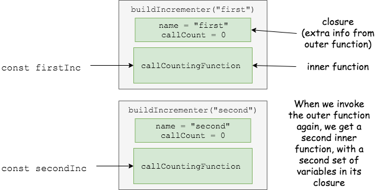

# Intro to Closures in JavaScript

<iframe src="https://adaacademy.hosted.panopto.com/Panopto/Pages/Embed.aspx?id=4900e4af-b42d-4be5-bb1e-ab8a00712d89&autoplay=false&offerviewer=true&showtitle=true&showbrand=false&start=0&interactivity=all" height="405" width="720" style="border: 1px solid #464646;" allowfullscreen allow="autoplay"></iframe>

This lesson assumes that you're comfortable with ES6 arrow function syntax.

## Learning Goals
By the end of this lesson, students should be able to...

- Identify closures when they occur in code
- Explain why closures are important and useful
- Enumerate the three steps to create a closure in JavaScript

## Introduction

Sometimes, in larger projects that use JavaScript, we may need to do similar, repeated functionality, like assigning the next integer ID. Imagine writing bEtsy in JavaScript, where you have 100+ products that all have product IDs, but you don't have postgres to automatically create and assign the next sequential product ID. How would you write this in JavaScript?

Creating and assigning the next sequential integer ID could be a very straightforward. We'd probably want to make a function named `assignNextID()`. Within that function, we could find the last-assigned ID and then increment by one, then return that value. However, knowing what the last-assigned ID or all of the used IDs is tricky; how does one part of the program know what the last-assigned ID? More specifically, how can one part of the program know what the last-assigned ID is without a global variable?

We need a way to make the information/data available to a function without relying on global variables.

JavaScript has a way to make the information/data available to a function without relying global variables: it's to use a specific style of writing functions known as closures. Closures are so cool and powerful, that they can do way more beyond the example we just mentioned.

**Closures** are a language feature that **allows attaching extra information to a function.**

## Making a Closure

Let's start learning about closures by first making one.

Let's make a function that knows how many times it has been called. Each time you call it, it will print the total number of calls to the console. We'll use it like this:

```javascript
const incrementer = // build this closure somehow

               // Each call prints out:
incrementer(); // This is call number 1
incrementer(); // This is call number 2
incrementer(); // This is call number 3
```

To create a closure in JavaScript, you need to do three things:

1. Nest a function inside a function
1. Reference a variable from the outer function in the inner function
1. Make the inner function available outside the outer function
    - There are multiple ways to do this, but a common way is to return an inner function from an outer function, and that is what we will focus on in this lesson.

```javascript
// Here is the outer function
const buildIncrementer = () => {
  // callCount is defined in the outer function
  let callCount = 0;

  // Here is the inner function
  const callCountingFunction = () => {
    // callCount is used in the inner function
    callCount += 1;
    console.log(`This is call number ${callCount}`);
  }

  // Here we return the inner function, creating
  // a closure.
  return callCountingFunction;
};

const incrementer = buildIncrementer();

               // Each call prints out:
incrementer(); // This is call number 1
incrementer(); // This is call number 2
incrementer(); // This is call number 3
```

<details>
<summary>**Question:** On the line `return callCountingFunction`, what would happen if we changed the the line by added parentheses, to `return callCountingFunction()`?</summary>
Instead of returning the function `callCountingFunction`, the line would call `callCountingFunction` (which will add 1 to `callCount` and print 'This is call number 1' to the console).  The function `callCountingFunction` does not have a return value, so it will return _`undefined`_, which will then be returned by `buildIncrementer`.  Calling `incrementer()` will throw a `TypeError`, because `incrementer` is equal to _`undefined`_, which is not a function.
</details>

### Multiple Closures

The usefulness of this closure becomes especially clear when you need multiple incrementers:

```javascript
const buildIncrementer = () => {
  // ...same as before...
};

const firstInc = buildIncrementer();
const secondInc = buildIncrementer();

firstInc();  // This is call number 1
firstInc();  // This is call number 2
firstInc();  // This is call number 3

secondInc(); // This is call number 1
secondInc(); // This is call number 2

firstInc();  // This is call number 4
```

The two functions track their counts separately. Not only can we use a closure to attach extra information, we can attach _different_ information to each function.

This is exciting because it means we can generate many functions that are similar but distinct. This is not something we could do so easily in Ruby.

### Closures from Parameters

As an example, let's expand our incrementer example to give each generated function a name.

```javascript
const buildIncrementer = (name) => {
  let callCount = 0;

  const callCountingFunction = () => {
    callCount += 1;
    console.log(`This is call number ${callCount} for function ${name}`);
  }

  return callCountingFunction;
};

const firstInc = buildIncrementer("first");
const secondInc = buildIncrementer("second");

firstInc();  // This is call number 1 for function first
firstInc();  // This is call number 2 for function first
firstInc();  // This is call number 3 for function first

secondInc(); // This is call number 1 for function second
secondInc(); // This is call number 2 for function second

firstInc();  // This is call number 4 for function first
```

Note that we reference a parameter of the outer function. Parameters are a special type of local variables, so they work for closures as well.


<!-- https://www.draw.io/#G18RoR2FDhey0XMYD5GLZinnug9p2ksL2u -->

## Closures Under the Hood

<details>
<summary>Curious about how closures work under the hood?  Click here for more!</summary>

Closures are incredibly powerful but they can also be confusing.  Here's a high level overview of how they work.  Normally, when a function is executed, the context for the function is placed on the stack (things like local variables, parameters, etc).  When the function exits, a return value may be returned and then all of the local vars for a function are popped off the stack and discarded.  Any local vars that existed inside the function are gone.  

Closures fundamentally changes this system.  Let's say function `awesomeFunction` has a local variable `bestVarEver` and creates function `bestFunction` that uses `bestVarEver` and then function `awesomeFunction` returns `bestFunction`.  JavaScript will take a look at `bestFunction` and notice that it uses a local variable from `awesomeFunction` and _keep `awesomeFunction` on the stack_.  `awesomeFunction` is no longer running, but the execution context that holds all of the local variables will continue to exist as long as something (in this case `bestFunction`) is still using it.
</details>

## Exercise: Reading Closures

Take a look at the following code snippet:

- [Adder](https://repl.it/@adadev/Closures-Example-Adder)

Walk through the code and identify:
1. Where is the closure?
1. What does the code do?
1. How does the closure take advantage of the outer function's variables?
1. How does the inner function "get out" of the outer function?

## Summary

- Closures are a technique for adding a bit of extra information to a function
- In JavaScript, creating a closure requires 3 steps:
    1. Create a function within a function
    1. In the inner function, reference a local variable from the outer function
    1. Make the inner function available outside the outer function
- Closures are a very useful tool when defining behavior for repeated UI elements

## Additional Resources

- [I never understood JavaScript closures until...](https://medium.com/dailyjs/i-never-understood-javascript-closures-9663703368e8)
- [Video: Understanding Closures](https://www.youtube.com/watch?v=rBBwrBRoOOY)
- [Closures](http://javascriptissexy.com/understand-javascript-closures-with-ease/)
- [MDN on Closures](https://developer.mozilla.org/en-US/docs/Web/JavaScript/Closures)