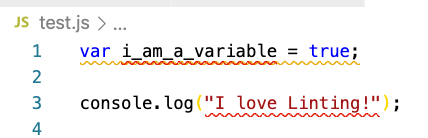
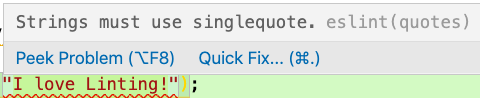

# Linting Setup for Javascript

This walkthrough will help you set up the `eslint` linter to use the ESLint recommended settings globally and help you write cleaner JavaScript.  Many developers use specific linter configurations to enforce coding style guides.

<iframe src="https://adaacademy.hosted.panopto.com/Panopto/Pages/Embed.aspx?pid=beb19241-0442-4a66-888e-ac7d0146fcd5&autoplay=false&offerviewer=true&showtitle=true&showbrand=false&start=0&interactivity=all" height="405" width="720" style="border: 1px solid #464646;" allowfullscreen allow="autoplay"></iframe>

## Learning Goals:

After completing this lesson we should be able to...

- Explain what a code style guide is
- Write JavaScript with a linter highlighting errors and warnings


[Source](https://xkcd.com/927/)

## Lint???

The term linting comes from the tiny bits of fiber shed from clothing.  The idea is that we want to get rid of the "fluff" or unwanted bits of code that promote poor practices or are contrary to the team's agreed upon style guide.

## A Note On Style Guides

Many software teams adhere to a set of rules which serve as guidelines for how to write and organize code.  Linters can be an integral part of a team's style conventions.

__Why use a style guide?__  Style guides are a common way for a group of people to create consistently formatted documents. Like MLA or the Chicago Manual of Style, a code style guide helps us find the information we are looking for as quickly as possible.

In a large team, with programmers from a lot of different language backgrounds, it's easy to fall into whatever habits your first programming language encouraged. A Python whiz might default to using indentation alone to show where a code block begins and ends, where a C programmer at heart might feel more comfortable surrounding code blocks in curly braces. With small differences like these, one slight difference between two programmers may go unnoticed, but as teams get bigger and more and more styles mix, code becomes increasingly ugly and unreadable. 

Simply put, style guides help us keep code formatted consistently between developers, making for fewer context switches, and hopefully fewer dumb mistakes.

- [AirBNB](https://github.com/airbnb/javascript) has a well documented coding standard that is very popular.
- [Google](https://google.github.io/styleguide/jsguide.html) also has a popular coding style guide.

We will use the linting setting [ESLint Recommended](https://eslint.org/docs/rules/) and [ESLint-react](https://github.com/yannickcr/eslint-plugin-react) which have a rather minimal set of linting rules to highlight common JavaScript problems.

## Installing VS Code Extension

In VS Code please install the Eslint extension.  This extension will work with a JavaScript module called Eslint to highlight and even fix style and formatting issues.

- [Eslint](https://marketplace.visualstudio.com/items?itemName=dbaeumer.vscode-eslint)

Some useful, but not required extensions for JavaScript:
- [Bracket Pair Colorizer](https://marketplace.visualstudio.com/items?itemName=CoenraadS.bracket-pair-colorizer) - This makes matching brackets and braces `{}, () and []` show up as matching colors.
- [Jest Runner](https://marketplace.visualstudio.com/items?itemName=firsttris.vscode-jest-runner) - a way to run specific tests in VS Code.
- [Live Share](https://marketplace.visualstudio.com/items?itemName=MS-vsliveshare.vsliveshare)   
    - A way to collaborate on the same file in VS code remotely.
    - It does disable some [code lenses](https://code.visualstudio.com/blogs/2017/02/12/code-lens-roundup) when it's running.
- [Prettier Eslint](https://marketplace.visualstudio.com/items?itemName=rvest.vs-code-prettier-eslint) - A formatter to fix format or style mistakes automatically.
- [Indent Rainbow](https://marketplace.visualstudio.com/items?itemName=oderwat.indent-rainbow) - uses colors to help you match indentation.

## Linting on Existing Projects

In your projects at Ada you will have a file with the rules for your linter called `.eslintrc.json`.  Here is an example `.eslintrc.json` file.

```json
{
  "env": {
    "browser": true,
    "es2021": true,
    "node": true
  },
  "extends": ["plugin:jest/recommended", "eslint:recommended"],
  "parserOptions": {
    "ecmaVersion": 12,
    "sourceType": "module"
  },
  "plugins": ["jest"],
  "rules": {
    "no-unused-vars": "warn",
    "no-var": "warn",
    "no-console": "off",
    "func-names": "off",
    "comma-dangle": ["warn", "only-multiline"],
    "quotes": [
      "error",
      "single",
      { "allowTemplateLiterals": true, "avoidEscape": true }
    ],
    "camelcase": "error"
  }
}
```

The file is broken into a few sections:

- **env**:  This defines what kind of environment your JavaScript code will run in.  This is so Eslint knows what to look for.  This example is set to run in the browser and with node (command-line).  It's also set to run in the latest version of Ecmascript (JavaScript).
- **extends**:  This is a set of pre-defined rules you want to start with.  In this example we're starting with the "standard" eslint rules.  
  - Later we will use this set to enforce best-practices in React.
    - `["eslint:recommended", "react-app", "react-app/jest"]` 
- **parserOptions**: ESLint allows you to specify the JavaScript language options you want to support. By default, ESLint expects ECMAScript 5 syntax. You can override that setting to enable support for other ECMAScript versions as well as JSX by using parser options.
- **plugins**: These specify additional plugins to eslint to do additional linting.  In this case we're using a module to lint our tests from the Jest testing library.
- **rules**:  You can then turn individual linting rules on and off.  You can take a look at the [online documentation](https://eslint.org/docs/rules/) for the list of possible rules and what they mean.

You can adjust the `.eslintrc.json` file to add or remove rules you want to use.

**Exercise**
 
Take a look at one rule defined in our `.eslintrc.json` file here and look it up in the [Eslint Rules Documentation](https://eslint.org/docs/rules/).  Then answer the following:

- What does it do?
- Give an example of a good and bad style under this rule.
- How do you turn it on or off?


## Lets Try!

Go ahead and clone [The JS-Calculator Project](https://github.com/ada-c14/js-calculator)

Then run `npm install` to install the project libraries.

Add the following code to `calculator.js`

```javascript
var i_am_a_variable = true;

console.log("I love Linting!");
```

If you get this, it's working



You can click on a warning or error and pick **peek problem** to see what's wrong.



Notice the `Quick Fix` link on the right-side of the message.  That will open a sub-menu that can take you to an eslint page about the rule.  If you get this message, it worked!

## Sample Ada Linting Configurations

We also have a [separate resource file](examples/eslintrc.examples.resource.md) listing a couple of linting configurations we will use at Ada.


## Optional:  Setting up Eslint On a New Project

You _can_ set up eslint globally so all your code is linted the same.  However its not recommended.  This is because you may work on different teams or projects with different style requirements.  In most of our projects we will have a `.eslintrc.json` file in the project home folder to set the style rules we want to enforce at Ada.

These steps walk you through creating a new Javascript project from scratch.

1. Create a new folder for the project.
  - `mkdir sample_project`
1. Enter the project folder.
  - `cd sample_project`
1. Create a new `package.json` with just the default values (feel free to answer however you like)
  - `npm init`
  ```bash
    This utility will walk you through creating a package.json file.
    It only covers the most common items, and tries to guess sensible defaults.

    See `npm help init` for definitive documentation on these fields
    and exactly what they do.

    Use `npm install <pkg>` afterwards to install a package and
    save it as a dependency in the package.json file.

    Press ^C at any time to quit.
    package name: (sample_project) sample_project
    version: (1.0.0) 
    description: 
    entry point: (index.js) 
    test command: 
    git repository: 
    keywords: 
    author: 
    license: (ISC) 
    About to write to /Users/cheezitman/ada/JavaScript/sample_project/package.json:

    {
      "name": "sample_project",
      "version": "1.0.0",
      "description": "",
      "main": "index.js",
      "scripts": {
        "test": "echo \"Error: no test specified\" && exit 1"
      },
      "author": "",
      "license": "ISC"
    }


    Is this OK? (yes) yes
   ```
1. Install eslint
  - `npm i --save-dev eslint`
1. Setup linting.
  - `npx eslint --init`
    - Answer the questions as best you can, but you can overwite anything once it's done.
1. Inspect your eslint configuration file (normally `.eslint.json`)

You can then install plugins and watch how their rules change how eslint functions.

**Optional Exercise**

Install the [Airbnb](https://www.npmjs.com/package/eslint-config-airbnb) Style guide plugin.

- How is it different?
- Do you notice any similarities?
- Do you like it?
  - Why?

## Summary

In this exercise we set up VS Code to use the ESLint recommended coding standards by default in any JavaScript file we create (ending with .js).  To do so we had to install some node modules (like Ruby Gems) and install `ESLint` extension in VS Code.  We also looked at how we can configure and adjust the rules we want to enforce on our projects.

## Resources

- [How to setup ESLint Globally](https://www.stanleyulili.com/javascript/how-to-set-up-eslint-globally-with-vscode/)
- [AirBNB JavaScript Style Guide](https://github.com/airbnb/javascript)
- [Google JavaScript Style Guide](https://google.github.io/styleguide/jsguide.html)
- [A more generic style guide](https://github.com/standard/standard)
- [Why I Use a JavaScript Style Guide and Why You Should Too](https://www.sitepoint.com/why-use-javascript-style-guide/)
