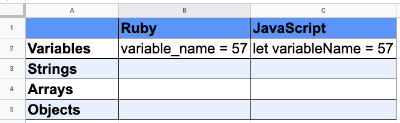

# Welcome to Your Second Language!

## Learning Goals

By the end of this lesson we will be able to...

- Create a list of topics to consider when learning a new programming language
- Create a list of questions to consider when learning a new programming language
- Compare which topics are the highest priority to practice: syntax
- Apply some of these considerations to JavaScript specifically

## So You're Learning a New Programming Language

Why did you start programming? Why did you pick the languages and tools you did? Overwhelmingly, the reason why most people start programming with a specific language is straightforward: because you had to. Likely, someone else made the decision of what language and tool you needed to use. (Maybe it was Ruby for the Ada application?)

But now that we have one language and programming fundamentals under our belt, we can approach a second language with intention.

Broadly, when learning a new programming language, here is a list of things to consider initially:

- What is the history of this language?
- What is the context that this language lives in now? How is it being used?
- On a high-level, what are the programming paradigms that this programming language is capable of?
- What are our best ways of learning and practicing this language?
    - How do we find resources on this language? (What documentation is most relevant? What tutorials do we like?)
    - How do we do "Hello World"?
    - How can we compare/contrast this language to our other knowledge, so our overall knowledge of programming expands?
    - What syntax do I need to learn?
    - What definitions do I need to learn?
    - What study patterns, study habits, and study behaviors do I need to learn in order to keep learning this successfully?

Studying a new language can be intimidating

Studying a new language relies on independently-driven learning even more. Rely on your notes, on others and collaboration, and on online resources even more. Continue to practice the skill of asking questions!

## About JavaScript

- Context/history
    - Made in 10 days in 1995
    - Made as a "competitor" to Java. Not related to Java in any other way.
    - Has dramatically evolved
    - Is made to be able to be able to run in the browser
    - Now most in-demand language in industry
- JavaScript relies on the same fundamentals
    - Declarative
    - Supports object-oriented programming

Knowing that JavaScript is compatible with all of our same programming fundamentals, it's all about syntax and knowing how to Google for more

### Hello World

The Hello World exercise is famously a challenge to get you to write a first line of code in any programming language or concept.

## Things You Must Keep Track Of When Learning a New Language

### Keep a List of Why You Want to Learn This Language

Make a list of reasons why you want to learn this language. It's okay if the reason is "because I need to for work"! But are there deeper reasons that you can additionally rally behind? Is this language a good choice for the future of your software product? Is this language a good choice for your career?

When learning a new language feels hard, you may be tempted to give up and go to something you're familiar with. Having a list of why you want to learn this language can help re-focus you.

### Compare and Contrast Between Languages

Make a list of the differences between your new and old languages.

- What's different between them?
- What's the same?

Making a table is often a good way to illustrate this.

### Make Notes to Help Learn Syntax and Definitions

Even with your first programming language, syntax was *the wooooorst* to get tripped up on. But now that you know what a syntax error is, as well as knowledge of other programming fundamentals, we can start to approach concepts with pre-existing context.

JavaScript syntax is famously very picky, even moreso than Ruby.

- Make flash cards
    - Seriously! This will help you get over syntax missteps and typos even faster
    - Make flash cards for common lines of code that you'll have to write, like declaring variables, reading data structures (like arrays), making methods/functions, etc.
    - Have a cheat sheet. Make a huge table that says how to do something, so you can start from somewhere. Have a separate table for "exceptions" or times that things break those rules

**Definitions:** you'll learn more definitions, or maybe you just need a clear definition of something on hand

    - Make flash cards! This is a great way to learn a definition
    - Make a glossary/cheat sheet, so you can look things up

## Questions to Keep In Your Head

Every time we jump into a new programming context, it's always good to think ahead and *think like a programmer.*

- How do we verify this/test this?
- What do errors look like?
- How do I read the stack trace?
- How do I debug this?
- Later on, think about: How do I design programs with this?

## Deep Learning Comes from Practice

Don't forget, deep learning comes with PRACTICE, RUNNING CODE, and WRITING IT with your own hands.

- Copy/paste is good, but at least read through the code and run it yourself.
- Don't just guess at what happens, run and confirm

## Summary: Learning a New Programming Language is Weird

We will leave TODAY learning the same syntax that you learned in the first week of Ruby.

Learning a new programming language can be weird:

- It can be easy: When concepts match, they transfer, and in programming, hopefully a lot of concepts transfer
- It can be challenging: Things that used to make sense may not make sense anymore. You may find that something you thought you understood is actually something you don't understand. Have compassion, and use this as an opportunity to re-learn those concepts
- As always: don't aim for perfect, deep understanding. Aim for knowing enough that you can look up what you need in the future, and trust in your own ability to research and learn.

## Resources

- [JavaScript in 5 Minutes](https://youtu.be/c-I5S_zTwAc) - Video
- [FreeCodeCamp Course in JavaScript](https://youtu.be/PkZNo7MFNFg)- Video Course 3.5 hours
- [JavaScript.info Language Resource](https://javascript.info/) - Text-based resource